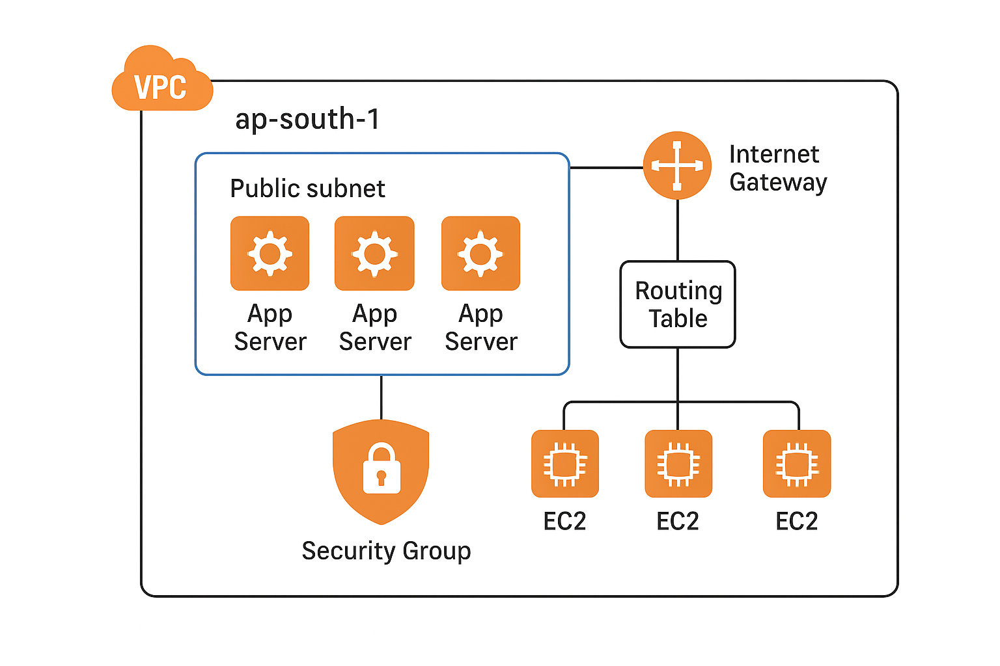
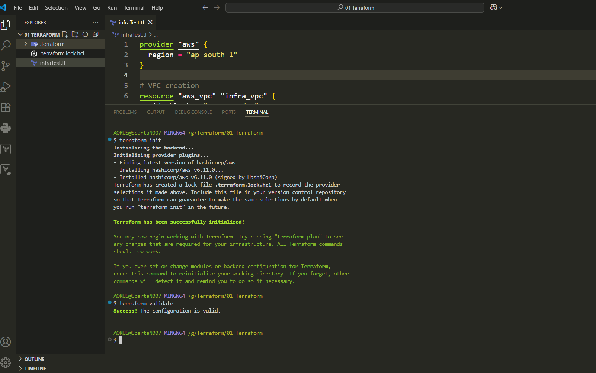
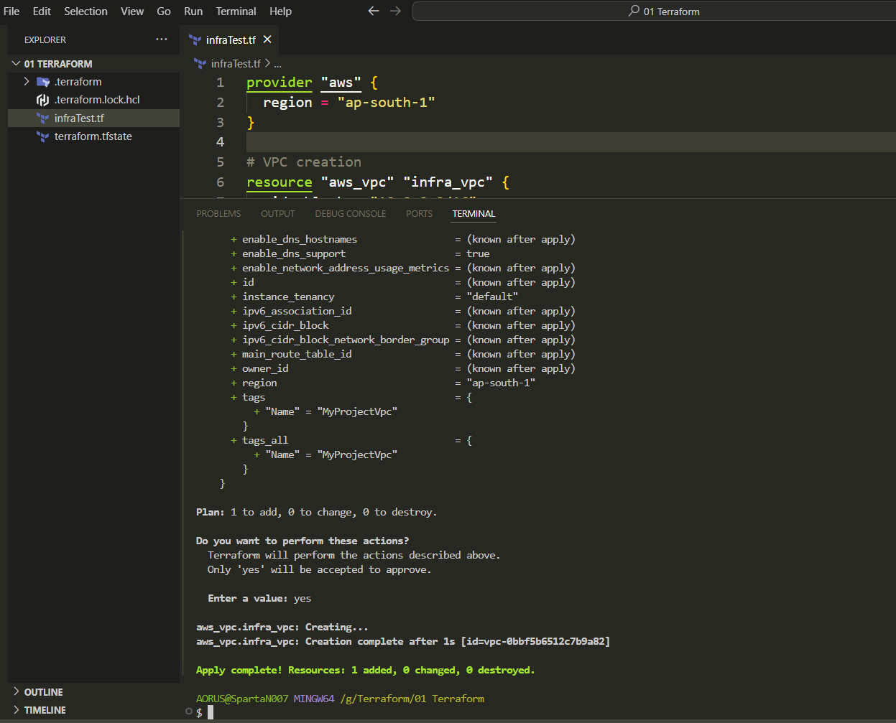
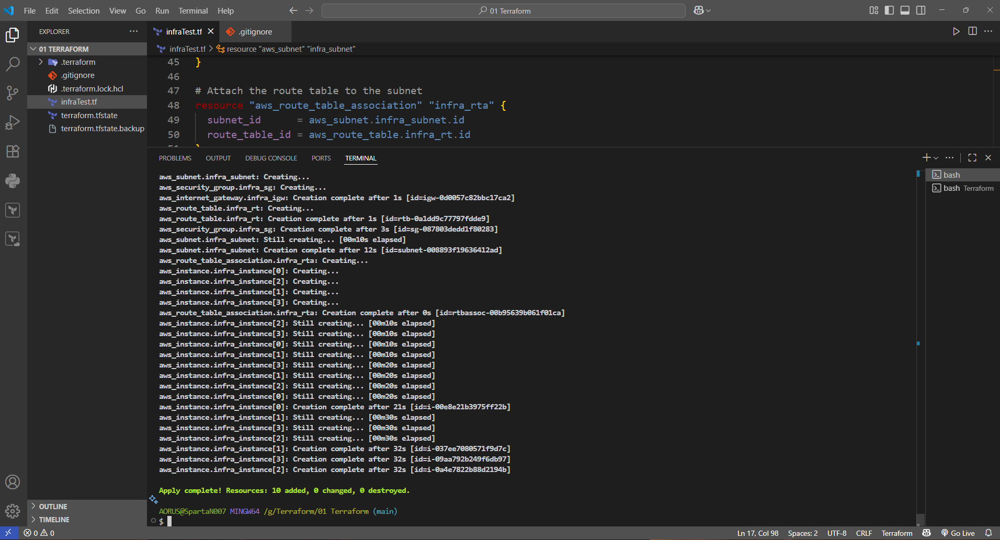
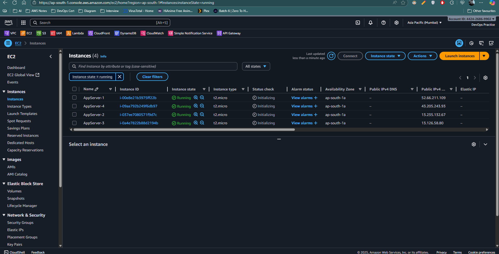

# Terraform AWS Infrastructure

This project provisions AWS infrastructure using **Terraform** and prepares the setup for further configuration with **Ansible**.

---

## 📌 Tools Used

* **Terraform** → Infrastructure as Code (IaC) tool for provisioning resources.
* **AWS CLI** → To authenticate Terraform with AWS.
* **Ansible** → (Next step) Configuration management tool to install software on provisioned infra.

---

## ⚙️ Prerequisites

1. AWS Account

2. IAM User with `AdministratorAccess` (or required permissions)

3. AWS CLI installed & configured

   ```bash
   aws configure
   ```

   Enter your:

   * AWS Access Key ID
   * AWS Secret Access Key
   * Default region → `ap-south-1`
   * Output format → `json`

4. Terraform installed → [Install Terraform](https://developer.hashicorp.com/terraform/downloads)

---

## 📂 Infrastructure Created

* **VPC** → CIDR `10.0.0.0/16`
* **Subnet** → Public subnet in `ap-south-1a`
* **Internet Gateway**
* **Route Table** with default route to IGW
* **Security Group** → Allow SSH (22) inbound, all outbound
* **EC2 Instances** → 4 total

  * 3 App Servers
  * 1 Ansible Control Node

---

## 🚀 Terraform Workflow

1. Initialize project

   ```bash
   terraform init
   ```

2. Validate configuration

   ```bash
   terraform validate
   ```

3. Preview changes

   ```bash
   terraform plan
   ```

4. Apply (provision infrastructure)

   ```bash
   terraform apply
   ```

5. Destroy (clean up all resources)

   ```bash
   terraform destroy
   ```

---

## 🖥️ Example Output

✔️ VPC + Subnet created in `ap-south-1`
✔️ Internet Gateway attached & Route Table associated
✔️ Security Group created with SSH access
✔️ 4 EC2 instances running (`t2.micro`)

---

## 📸 Screenshots

AWS Infra



Terraform Creation



Resource Creation 1 VPC for Test



Complete Resource Creation with VPC, Subnet, Internet Gateway, Routing Tables, 4 instances and Security Group



AWS EC2 Console



---

## 🔮 Next Steps

* Use **Ansible** on the control node to install software (e.g., Nginx, Docker, monitoring agents) across all EC2 instances.
* Extend Terraform to provision RDS, Load Balancers, and Autoscaling Groups.

---

## 📌 Topics

Terraform • AWS • IaC • DevOps • Cloud Infrastructure • Ansible
