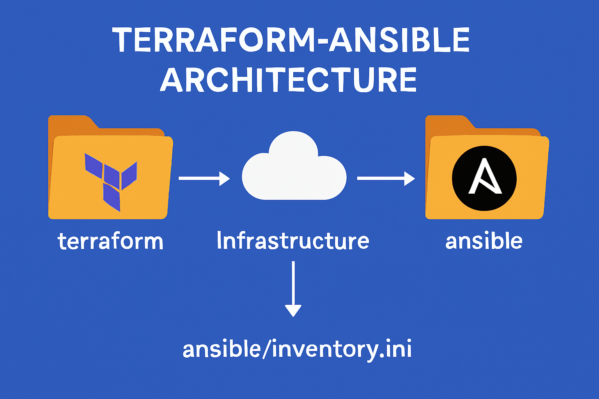
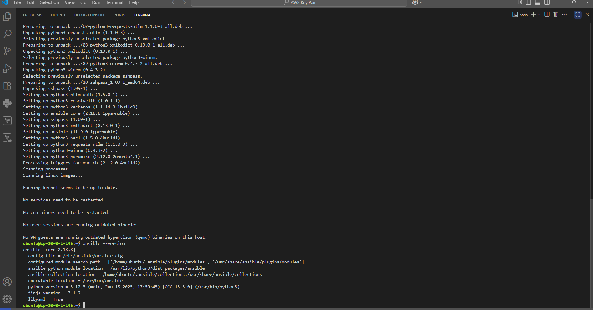
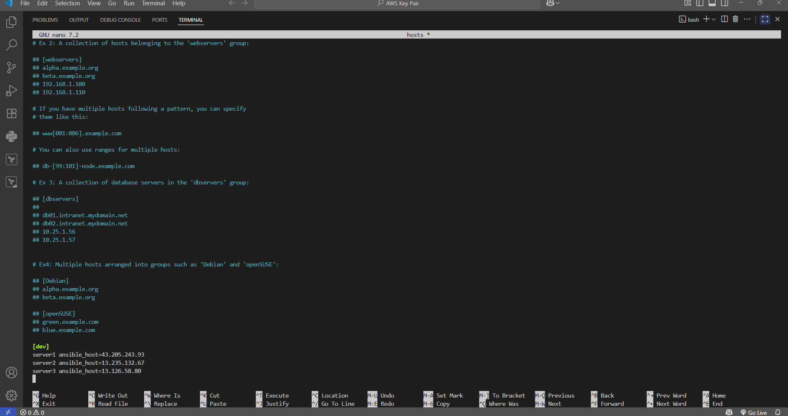
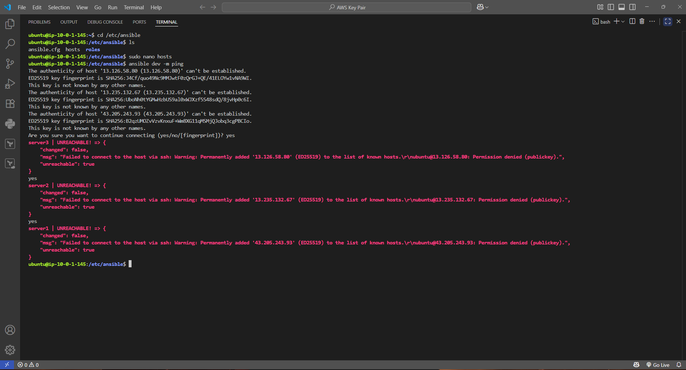
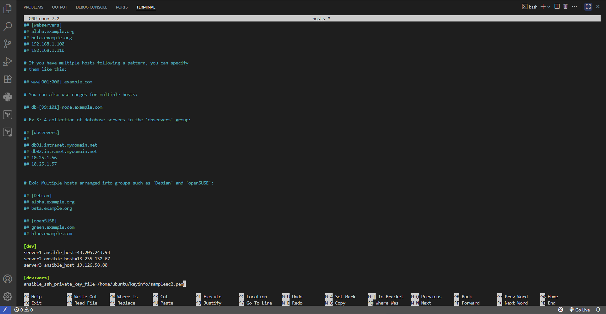
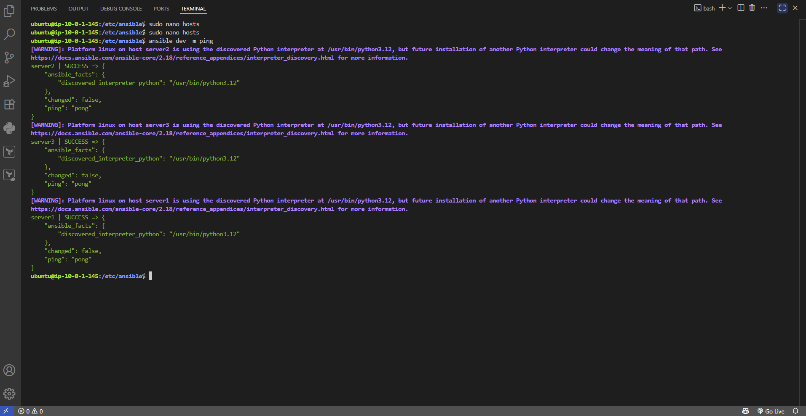
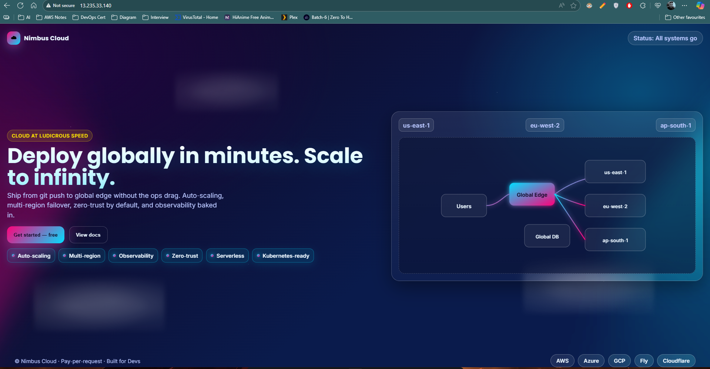
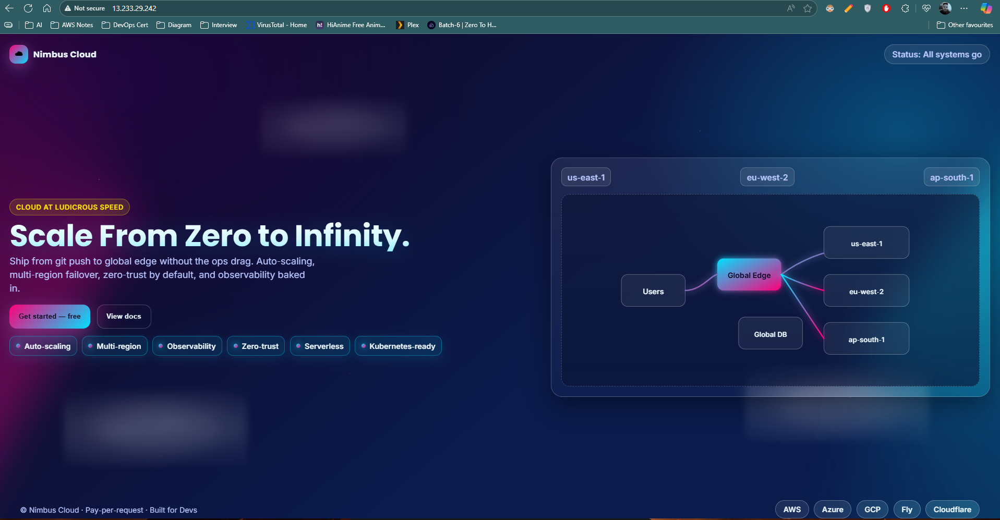
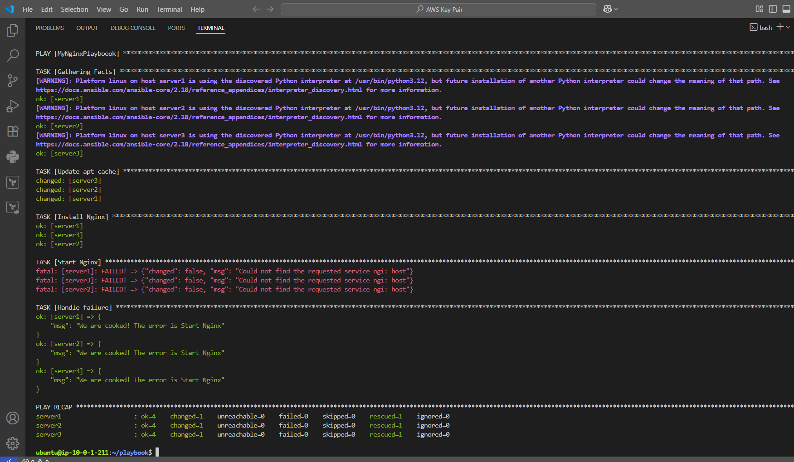

# 🌍 Terraform + Ansible Project

This project demonstrates how to provision AWS infrastructure using **Terraform** and then configure it using **Ansible**.  
It combines **Infrastructure as Code (IaC)** with **Configuration Management (CM)** for a complete DevOps workflow.

---

## 🚀 Project Workflow

1. **Provision Infrastructure with Terraform**
   - Create a VPC
   - Subnet
   - Internet Gateway
   - Route Table & Association
   - Security Group
   - 4 EC2 Instances (Ubuntu)

2. **Configure Servers with Ansible**
   - Install Ansible on one EC2 instance
   - Add target EC2s in `/etc/ansible/hosts`
   - Enable key-based access with `.pem` file
   - Deploy and configure Nginx using **Ansible Playbook**

---

## 🛠️ Tools Used
- **Terraform** → Infrastructure provisioning on AWS  
- **Ansible** → Configuration management & application deployment  
- **AWS CLI** → Manage credentials and region setup  
- **Ubuntu** → OS for EC2 instances  

---

## 📂 Terraform Resources
- VPC, Subnet, Internet Gateway  
- Route Table + Association  
- Security Group  
- 4 EC2 Instances (3 app servers + 1 Ansible server)  

Example: EC2 creation block
```hcl
resource "aws_instance" "infra_instance" {
  ami           = "ami-02d26659fd82cf299"
  instance_type = "t2.micro"
  key_name      = "sampleec2"
  subnet_id     = aws_subnet.infra_subnet.id
  count         = 4

  tags = {
    Name = "AppServer-${count.index + 1}"
  }

  vpc_security_group_ids = [aws_security_group.infra_sg.id]
}
````

---

## 📂 Ansible Configuration

1. **Inventory File (`/etc/ansible/hosts`)**

```ini
[dev]
server1 ansible_host=<Public/Private_IP1>
server2 ansible_host=<Public/Private_IP2>

[dev:vars]
ansible_ssh_private_key_file=/home/ubuntu/keyinfo/sampleec2.pem
```

2. **Sample Playbook (`nginx-playbook.yaml`)**

```yaml
- hosts: dev
  become: yes
  tasks:
    - name: Update apt repo
      apt:
        update_cache: yes

    - name: Install Nginx
      apt:
        name: nginx
        state: present

    - name: Deploy index.html
      copy:
        src: ./index.html
        dest: /var/www/html/index.html

    - name: Restart Nginx
      service:
        name: nginx
        state: restarted
      notify: Restart Nginx

  handlers:
    - name: Restart Nginx
      service:
        name: nginx
        state: restarted
```

---

## 🔐 Security Features

* **Ansible Vault** → Protects sensitive data (e.g., secrets.yaml)

```bash
ansible-vault create secrets.yaml
ansible-playbook -i /etc/ansible/hosts nginx-playbook.yaml --ask-vault-password
```

* **Block & Rescue** → Handles errors gracefully

```yaml
block:
  - name: Install Nginx
    apt:
      name: nginx
      state: present
rescue:
  - name: Handle failure
    debug:
      msg: "We are cooked! The error is {{ansible_failed_task.name}}"
```

---

## 📊 Architecture Diagram



---

## 📊 Screenshot

Ansible Installation



Adding IPs of Instances



Error while Deployment (due to .pem file) 



Adding .pem to Instance



Deployment Successful



Website Hosted Successfully via Nginx



Website Hosted Successfully After Changes With Just Anisble-Playbook Command



Ansible Handlers in Action



---

## ⚡ Key Learnings

* Terraform provisions infra consistently
* Ansible automates configuration and deployments
* Together, they reduce manual work and improve reliability in DevOps pipelines
